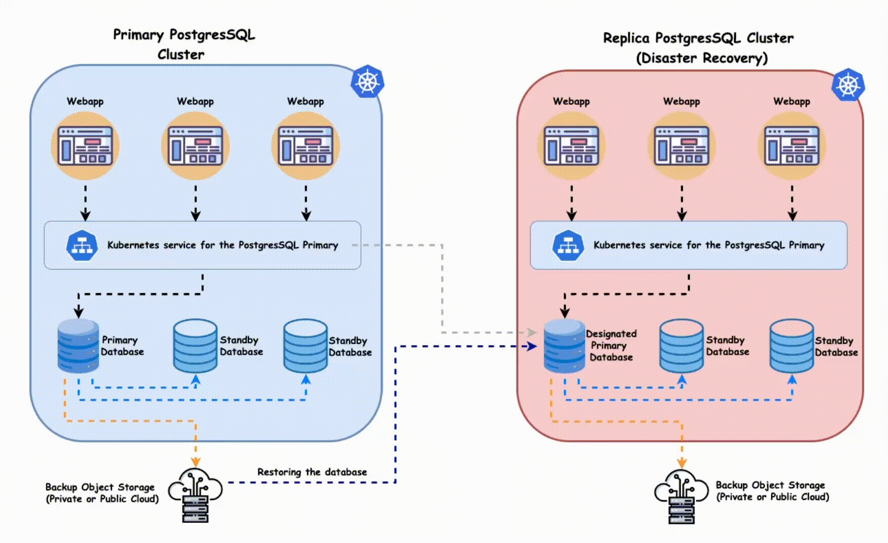

# PostgreSQL Setup Using Docker + DBeaver + AWS Deployment Guide

---

# 1. Overview Architecture

Local Development Architecture:

Application / DBeaver (Client)
        ↓
localhost:5432 (TCP)
        ↓
Docker Container (PostgreSQL Server)
        ↓
Docker Volume (Persistent Storage)

Production (AWS) Architecture Options:

Option 1: EC2 + Docker + PostgreSQL
Option 2: Amazon RDS (Managed PostgreSQL)
Option 3: ECS / EKS Containerized Deployment

---
<p align="center">
  
</p>


# 2. Prerequisites

## Install Docker

For Windows/Mac:
- Install Docker Desktop

For Linux:
- Install Docker Engine

Verify installation:

```bash
docker --version
```

Verify Docker Compose:

```bash
docker compose version
```

---

# 3. Create Project Structure

Create a project directory:

```bash
mkdir postgres-docker-setup
cd postgres-docker-setup
```

Create a file:

```bash
touch docker-compose.yml
```

---

# 4. Docker Compose Configuration (PostgreSQL Server)

Open `docker-compose.yml` and paste:

```yaml
version: '3.9'

services:
  postgres:
    image: postgres:15
    container_name: my-postgres
    restart: always
    environment:
      POSTGRES_USER: admin
      POSTGRES_PASSWORD: admin123
      POSTGRES_DB: mydatabase
    ports:
      - "5432:5432"
    volumes:
      - pgdata:/var/lib/postgresql/data

volumes:
  pgdata:
```

Explanation:

- image: postgres:15 → PostgreSQL version
- environment → credentials and default database
- ports → maps container port 5432 to localhost
- volumes → ensures persistent data storage
- restart: always → auto restart on system reboot

---

# 5. Start PostgreSQL Server

Run:

```bash
docker compose up -d
```

Verify container is running:

```bash
docker ps
```

Stop server:

```bash
docker compose down
```

Remove container + volume (Deletes data permanently):

```bash
docker compose down -v
```

---

# 6. Access PostgreSQL via DBeaver

## Install DBeaver
Download and install DBeaver Community Edition.

## Create New Connection

Connection Settings:

Host: localhost  
Port: 5432  
Database: mydatabase  
Username: admin  
Password: admin123  

Click "Test Connection" → Finish.

You can now:
- Create schemas
- Create tables
- Execute SQL queries
- View data visually

---
<!-- <p align="center">
  
</p> -->

# 7. Verify PostgreSQL Inside Docker (Optional CLI Access)

Access container shell:

```bash
docker exec -it my-postgres bash
```

Login to PostgreSQL CLI:

```bash
psql -U admin -d mydatabase
```

List tables:

```sql
\dt
```

Exit:

```bash
exit
```

---

# 8. Backup and Restore Strategy

## Backup Database

```bash
docker exec my-postgres pg_dump -U admin mydatabase > backup.sql
```

## Restore Database

```bash
cat backup.sql | docker exec -i my-postgres psql -U admin -d mydatabase
```

---

# 9. AWS Deployment Methods

There are multiple ways to deploy PostgreSQL on AWS.

<p align="center">
  
</p>

---

# Option 1: EC2 + Docker + PostgreSQL

Architecture:

Client → Public IP → EC2 Instance → Docker → PostgreSQL

Steps:

1. Launch EC2 instance (Ubuntu recommended)
2. Install Docker on EC2
3. Copy docker-compose.yml to EC2
4. Run:

```bash
docker compose up -d
```

5. Open Security Group inbound rule:
   - Port: 5432
   - Source: Your IP

Pros:
- Full control
- Lower cost

Cons:
- Manual maintenance
- You manage backups and scaling

---

# Option 2: Amazon RDS (Managed PostgreSQL) [Recommended for Production]

Architecture:

Client/Application → RDS Endpoint → Managed PostgreSQL

Steps:

1. Go to AWS RDS Console
2. Create Database
3. Select PostgreSQL
4. Configure:
   - Instance size
   - Storage
   - Username/password
5. Enable public access (if required)
6. Configure Security Group

Use RDS endpoint in DBeaver instead of localhost.

Pros:
- Automated backups
- High availability
- Automatic patching
- Monitoring

Cons:
- Higher cost
- Less OS-level control

Best for:
Production systems

---
<p align="center">
  
</p>

# Option 3: ECS (Elastic Container Service)

Architecture:

ECS Cluster → Docker Container → PostgreSQL

Use when:
- Microservices architecture
- Fully containerized system

Requires:
- Task definitions
- Service configuration
- Load balancer (optional)

---

# Option 4: EKS (Kubernetes)

Architecture:

Kubernetes Cluster → Pod → PostgreSQL

Used for:
- Large scale systems
- Cloud-native architectures
- Enterprise-level deployments

---
<p align="center">
  
</p>

# 10. Production Considerations

## Security
- Never expose 5432 publicly without restriction
- Use private subnets
- Enable SSL
- Use strong passwords

## Scaling
- Vertical scaling (Increase instance size)
- Read replicas
- Connection pooling (PgBouncer)

## Monitoring
- CloudWatch (AWS)
- Prometheus + Grafana

## Backups
- Automated snapshots
- Scheduled logical backups

---

# 11. Recommended Learning Path

1. Local Docker setup
2. Connect via DBeaver
3. Connect via Python (psycopg2 / SQLAlchemy)
4. Deploy on EC2
5. Migrate to RDS
6. Add monitoring and backups

---

# 12. Summary

Local Development:
Docker + PostgreSQL + DBeaver

Production (Simple):
EC2 + Docker

Production (Recommended):
Amazon RDS

Enterprise Level:
ECS or EKS

This setup ensures:
- Reproducibility
- Scalability
- Infrastructure control
- Clean development workflow

End of Guide.

